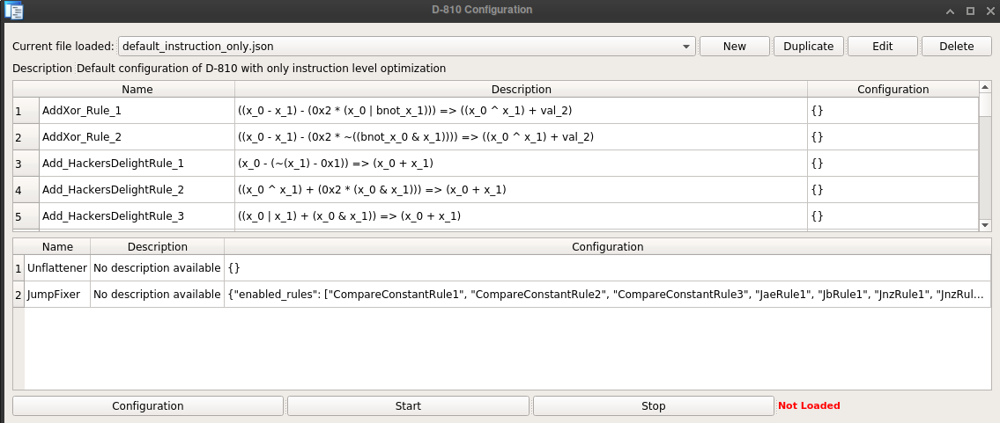

# Introduction

## What is D-810

D-810 is an IDA Pro plugin which can be used to deobfuscate code at decompilation time by modifying IDA Pro microcode.
It was designed with the following goals in mind:

* It should have as least as possible impact on our standard reverse engineering workflow
    * Fully integrated to IDA Pro
* It should be easily extensible and configurable
    * Fast creation of new deobfuscation rules
    * Configurable so that we don't have to modify the source code to use rules for a specific project
* Performance impact should be reasonable
    * Our goal is to be transparent for the reverse engineer 
    * But we don't care if  the decompilation of a function takes 1 more second if the resulting code is much more simplier.


# Installation

**Only IDA v7.5 or later is supported with Python 3.7 and higher** (since we need the microcode Python API) 

Copy this repository in `.idapro/plugins`

We recommend to install Z3 to be able to use several features of D-810:
```bash
pip3 install z3-solver 
```

# Using D-810

* Load the plugin by using the `Ctrl-Shift-D` shortcut, you should see this configuration GUI



* Choose or create your project configuration
  * If you are not sure what to do here, leave *default_instruction_only.json*. 
* Click on the `Start` button to enable deobfuscation
* Decompile an obfuscated function, the code should be simplified (hopefully)
* When you want to disable deobfuscation, just click on the `Stop` button.

# Warnings

This plugin is still in early stage of development, so issues ~~may~~ will happen.

 * Modifying incorrectly IDA microcode may lead IDA to crash. We try to detect that as much as possible to avoid crash, but since it may still happen **save you IDA database often**
 * We only tested this plugin on Linux, but it should work on Windows too.

# Documentation

Work in progress

Currently, you can read our [blog post](https://eshard.com/posts/) to get some  information.


# Licenses

This library is licensed under LGPL V3 license. See the [LICENSE](LICENSE) file for details.

## Authors

See [AUTHORS](AUTHORS.md) for the list of contributors to the project.

# Acknowledgement

Rolf Rolles for the huge work he has done with his [HexRaysDeob plugin](https://github.com/RolfRolles/HexRaysDeob) and all the information about Hex-Rays microcode internals described in his [blog post](https://www.hex-rays.com/blog/hex-rays-microcode-api-vs-obfuscating-compiler/). We are still using some part of his plugin in D-810.

Dennis Elser for the [genmc plugin](https://github.com/patois/genmc) plugin which was very helpful for debugging D-810 errors.
